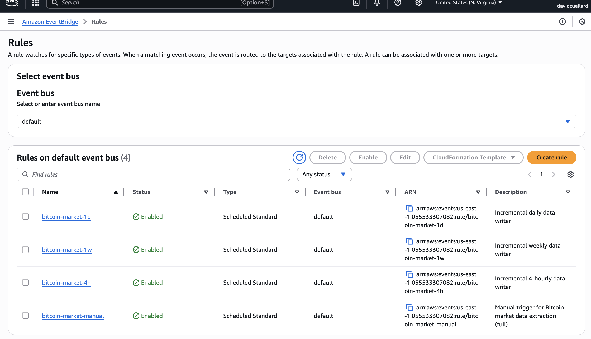
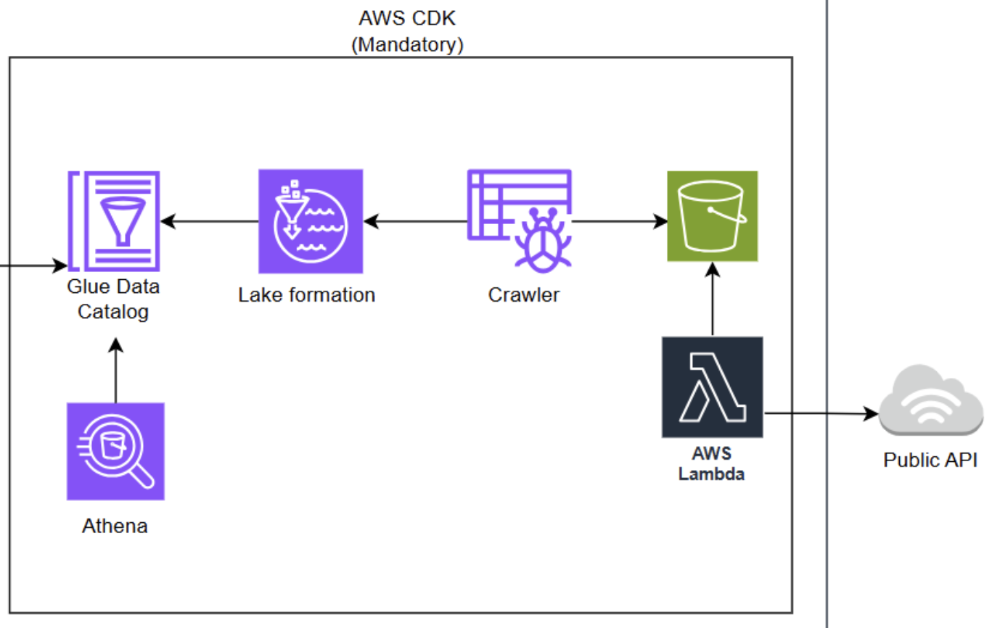
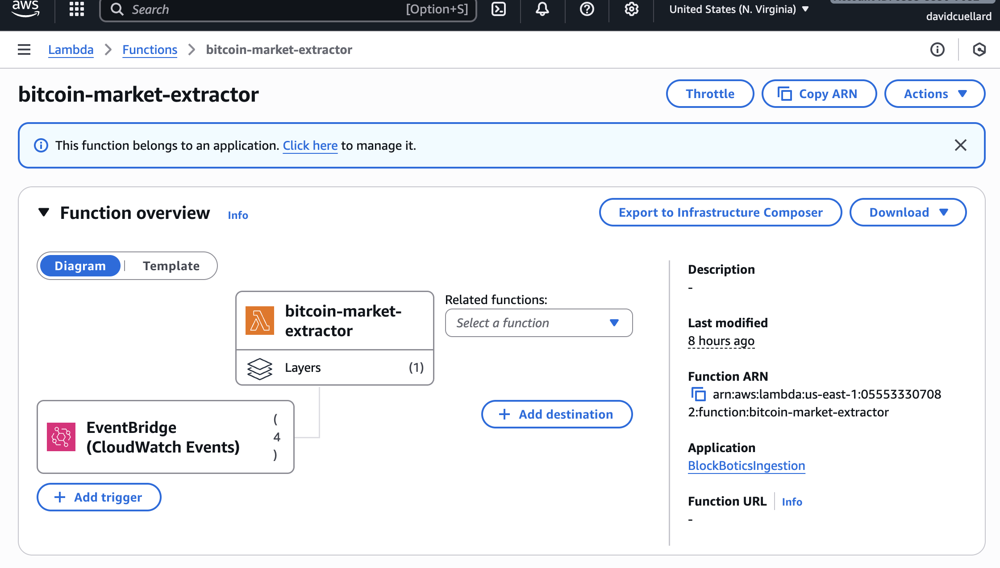
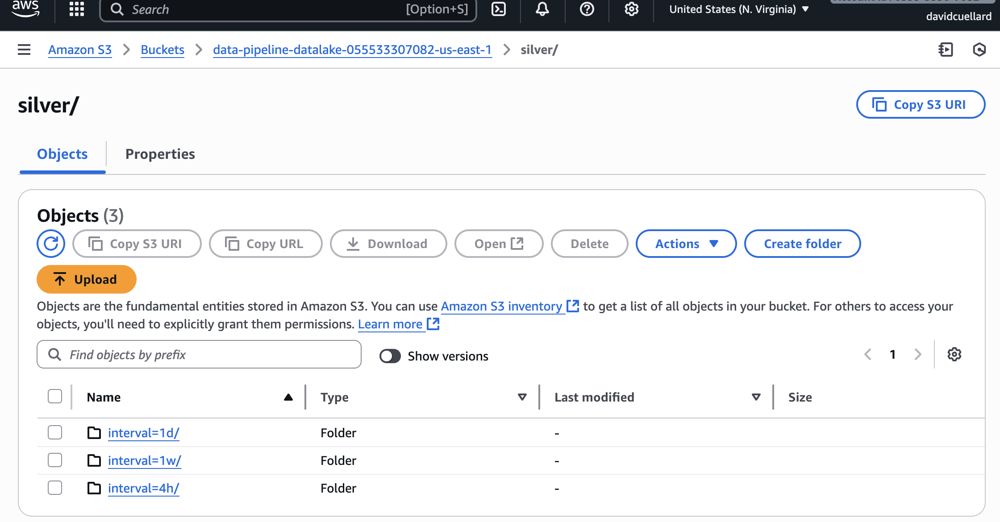
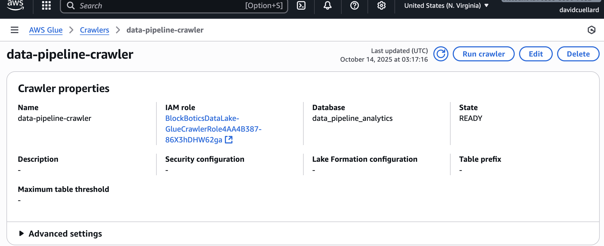
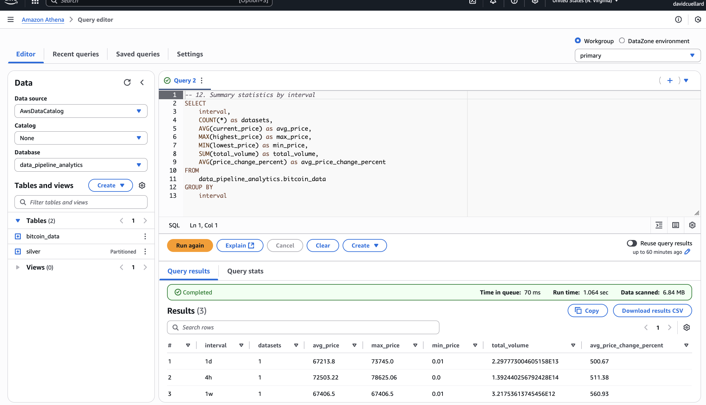

# AWS CDK Data Pipeline - Bitcoin Historical Data

A comprehensive serverless data pipeline built with AWS CDK that generates **complete Bitcoin historical datasets** from 2009 to 2025, stores them in S3, catalogs them with AWS Glue, and makes them queryable through Amazon Athena.

## 🎯 What This Pipeline Does

**Generates Complete Bitcoin Historical Data:**

- **Daily Data**: 6,126 records (every day from 2009-2025)
- **4-Hourly Data**: 36,756 records (every 4 hours from 2009-2025)
- **Weekly Data**: 875 records (every week from 2009-2025)
- **Total**: 43,757 Bitcoin data points covering the entire Bitcoin timeline

## Architecture

```
Complete Bitcoin History (2009-2025) → Lambda → S3 (Data Lake) → Glue Crawler → Athena
├── Daily Dataset (6,126 points)     │
├── 4-Hourly Dataset (36,756 points)  │
└── Weekly Dataset (875 points)      │
```

## Components

### 1. Data Lake Stack (`BlockBoticsDataLake`)

- **S3 Bucket**: Data lake storage with lifecycle policies
- **KMS Key**: Encryption for data at rest
- **Glue Database**: `data_pipeline_analytics`
- **Glue Crawler**: `data-pipeline-crawler` (discovers schema automatically)
- **Athena WorkGroup**: `data-pipeline-analytics`
- **Lake Formation**: Data governance and permissions

### 2. Ingestion Stack (`BlockBoticsIngestion`)

- **Lambda Function**: `bitcoin-market-extractor`
  - Generates **complete Bitcoin historical datasets** (2009-2025)
  - Creates **three datasets** with different time intervals:
    - **Daily Dataset**: 6,126 daily data points (every day from 2009-2025)
    - **4-Hourly Dataset**: 36,756 4-hourly data points (every 4 hours from 2009-2025)
    - **Weekly Dataset**: 875 weekly data points (every week from 2009-2025)
  - **Realistic price evolution** from $0.01 (2009) to $65,000+ (2025)
  - **Historical accuracy** with proper Bitcoin milestones and volatility
  - **Complete market data** including price, volume, market cap, timestamps
  - Stores data in S3 with partitioning by interval and date
  - Uses Lambda Layer for dependencies (requests)
  - Supports two modes:
    - **full**: build complete history for `1w`, `4h`, `1d`
    - **incremental**: write only the last closed period for a specific interval

#### Automated Schedules (EventBridge) — Bonus

- 4-hourly: runs at minute 5 past every 4th hour with payload `{ "mode": "incremental", "interval": "4h" }`
- Daily: runs at 02:00 UTC with payload `{ "mode": "incremental", "interval": "1d" }`
- Weekly: runs Mondays at 02:30 UTC with payload `{ "mode": "incremental", "interval": "1w" }`

These schedules ensure the S3 data lake stays up to date with the latest closed 4h/day/week windows.



### 3. Observability Stack (`BlockBoticsObservability`)

- **CloudWatch Dashboard**: `BlockBotics-DataPipeline`
- **CloudWatch Alarms**: Lambda errors, duration, DLQ messages
- **SNS Topic**: Alert notifications

## Visual overview

### Architecture



### Quick links (us-east-1)

- [Lambda: bitcoin-market-extractor](https://us-east-1.console.aws.amazon.com/lambda/home?region=us-east-1#/functions/bitcoin-market-extractor)
- [EventBridge rules](https://us-east-1.console.aws.amazon.com/events/home?region=us-east-1#/rules)
- [Glue Crawler: data-pipeline-crawler](https://us-east-1.console.aws.amazon.com/glue/home?region=us-east-1#crawler:tab=details;name=data-pipeline-crawler)
- [Athena workgroup: data-pipeline-analytics](https://us-east-1.console.aws.amazon.com/athena/home?region=us-east-1)
- S3 silver prefix: `s3://data-pipeline-datalake-<account>-<region>/silver/`

## Prerequisites

- AWS CLI configured with appropriate permissions
- AWS CDK v2 installed
- Python 3.11+
- Node.js (for CDK)

## Setup

1. **Clone and navigate to the project:**

   ```bash
   git clone <your_repo_url>.git
   cd aws-cdk
   ```

2. **Create and activate virtual environment:**

   ```bash
   python3 -m venv .venv
   source .venv/bin/activate
   ```

3. **Install dependencies:**

   ```bash
   pip install -r requirements.txt
   ```

4. **Bootstrap CDK (if not already done):**

   ```bash
   cdk bootstrap
   ```

5. **Deploy all stacks:**

   ```bash
   cdk deploy --all --require-approval never
   ```

   Tip: After the first full deploy, for code-only updates to the Lambda and schedules, deploy the ingestion stack exclusively to avoid touching dependencies:

   ```bash
   # From the aws-cdk folder
   cdk deploy BlockBoticsIngestion --require-approval never --exclusively
   ```

## 🚀 How to Run the Pipeline

### **Quick Start (Pipeline is Already Deployed!)**

Your pipeline is **already deployed and working**! Here's how to use it:

#### **Step 1: Generate Complete Bitcoin Historical Data**

```bash
# Activate environment
source .venv/bin/activate

# Generate complete 16-year Bitcoin dataset (43,757 data points)
aws lambda invoke --function-name bitcoin-market-extractor --payload '{}' response.json

# Check the results
cat response.json
```



#### Optional: Trigger Incremental Writes Manually

```bash
# 4-hourly incremental (last closed 4h window)
aws lambda invoke --function-name bitcoin-market-extractor \
  --cli-binary-format raw-in-base64-out \
  --payload '{"mode":"incremental","interval":"4h"}' resp_4h.json

# Daily incremental (previous full UTC day)
aws lambda invoke --function-name bitcoin-market-extractor \
  --cli-binary-format raw-in-base64-out \
  --payload '{"mode":"incremental","interval":"1d"}' resp_1d.json

# Weekly incremental (previous full week)
aws lambda invoke --function-name bitcoin-market-extractor \
  --cli-binary-format raw-in-base64-out \
  --payload '{"mode":"incremental","interval":"1w"}' resp_1w.json

# Wipe and full
aws lambda invoke --function-name bitcoin-market-extractor \
  --cli-binary-format raw-in-base64-out \
  --payload '{"mode":"full","wipe_prefix":"silver/"}' wipe_resp.json
```

**Expected Output:**

```json
{
  "StatusCode": 200,
  "ExecutedVersion": "$LATEST"
}
```

### Clean Reset (Delete and Re-Ingest)

Use the Lambda's wipe capability to remove existing data under a prefix, then run a fresh ingestion.

```bash
# Wipe all silver datasets (dangerous: deletes under silver/)
aws lambda invoke --function-name bitcoin-market-extractor \
  --payload '{"mode":"full","wipe_prefix":"silver/"}' wipe_resp.json

# Rebuild full history after wipe
aws lambda invoke --function-name bitcoin-market-extractor --payload '{}' full_resp.json

# Or selectively wipe one interval and re-run incremental
aws lambda invoke --function-name bitcoin-market-extractor \
  --payload '{"mode":"incremental","interval":"1d","wipe_prefix":"silver/interval=1d/"}' resp_after_wipe.json
```

#### **Step 2: Check Data in S3**

```bash
# List all data files (organized by interval)
aws s3 ls s3://data-pipeline-datalake-<account>-<region>/silver/ --recursive
```



#### **Step 3: Run Glue Crawler (Create Tables)**

```bash
# Start the Glue Crawler
aws glue start-crawler --name data-pipeline-crawler

# Check crawler status
aws glue get-crawler --name data-pipeline-crawler --query 'Crawler.State'
```



#### **Step 4: Query Data with Athena**

- Console: https://us-east-1.console.aws.amazon.com/athena/
- Workgroup: `data-pipeline-analytics`



## Monitoring

- **CloudWatch Dashboard**: https://us-east-1.console.aws.amazon.com/cloudwatch/home?region=us-east-1#dashboards:name=BlockBotics-DataPipeline
- **Lambda Logs**: Check CloudWatch Logs for function execution details

## Data Structure

The pipeline generates Bitcoin market data with the following structure:

```json
{
  "ingestion_timestamp": "2025-10-12T20:43:36.267840+00:00",
  "symbol": "BTC",
  "currency": "USD",
  "interval": "1d",
  "record_count": 6126,
  "data_source": "synthetic",
  "market_data": [{ "timestamp": 1230940800000, "price": 0.01 }]
}
```

## S3 Data Lake Structure

```
s3://data-pipeline-datalake-<account>-<region>/
└── silver/
    ├── interval=1d/ingestion_date=YYYY/MM/DD/...
    ├── interval=4h/ingestion_date=YYYY/MM/DD/...
    └── interval=1w/ingestion_date=YYYY/MM/DD/...
```

## Environment Variables

- `DATA_LAKE_BUCKET`: S3 bucket name for data storage
